<p align="center">
  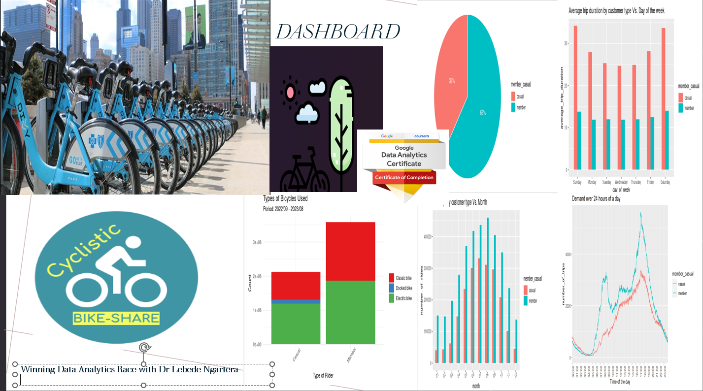</b><br>
</p>

```{r setup, include=FALSE}
knitr::opts_chunk$set(echo = TRUE)
```
# Case Study: How Does a Bike-Share Navigate Speedy Success?
## Introduction

As a part of the [Google Data Analytics Professional Certificat](https://www.coursera.org/professional-certificates/google-data-analytics) couse , I was given the opportunity to conduct a case study on Cyclistic to analyze the data and provide insights on the users’ behavior. The aim of this case study is to provide actionable insights for the company to consider in their marketing strategy. In order to improve its marketing strategy and drive future growth, the bike share company, Cyclistic, is based in Chicago and offers services to its users. The company is interested in understanding the behavior of its users while using the services. In this project, I will follow the steps of the data analysis process: ask, prepare, process, analyze, and share.
<p align="center">
  
</p>
## Scenario

Cyclistic operates a fleet of more than 5,800 bicycles, which can be accessed from over 600 docking stations across the city. Bikes can be borrowed from one docking station, ridden, then returned to any docking station. There are also user-friendly bike options, including electric bikes, classic bikes, and docked bikes, making Cyclistic services more inclusive to people.

Over the years, marketing campaigns have been broad and targeted a cross-section of potential users. Data analysis has shown that riders with an annual membership are more profitable than casual riders. Lily Moreno, the director of marketing, wants to implement a new marketing strategy to convert casual riders into annual members. She believes that with the right campaign, there is a very good chance of such conversions between the user types.

Lily has tasked the marketing analytics team to analyze past user data of one year to find trends and habits of Cyclistic’s users to help create this marketing campaign. The marketing analyst team would like to know:
1. How annual members and casual riders differ
2. Why casual riders would buy a membership?

How Cyclistic can use digital media to influence casual riders to become members.

In this context, you need to analyze the Cyclistic historical bike trip data to identify trends in the usage of bikes by casual and member riders.

## Phase 1: Ask

### Business objective

The aim of the case study is to identify opportunities for targeted marketing campaigns to convert casual cyclists into annual members. This will be achieved by analyzing cycling data and understanding user behavior and preferences. The ultimate goal is to increase profitability and stimulate future growth for the company. 

###  Stakeholders

The stakeholders involved in this case study are:

1-Lily Moreno: As the Director of Marketing at Cyclistic, Lily is responsible for implementing the marketing campaigns at Cyclistic.

2-Cyclistic’s Marketing Team: This team holds the responsibility for conducting the analysis and developing the marketing strategy based on the insights gained.

3-Cyclistic’s Casual Riders: This group constitutes the target audience of the marketing campaign, with a primary focus on analyzing their behavior and preferences.

4-Cyclistic’s Annual Members: This group is the target for conversion from casual riders, and their behavior and preferences will be compared to those of casual riders during the analysis.

5-Cyclistic’s Investors and Shareholders: With a financial interest in the company's success, investors and shareholders may closely follow the results of the analysis and any subsequent changes to the marketing strategy.


###  Business task (Stakeholders's Expectations)

As a Data Analyst, my duty is to support stakeholders' data-driven decision-making by following these steps:

b) Identify trends and patterns in the usage of bikes by casual and member riders.

c) Understand the behavior and preferences of these two user groups.

d) Identify opportunities for targeted marketing campaigns to convert casual riders into annual members.

e) Use insights from the analysis to inform the development of a new marketing strategy for the company.

f) The overarching goal is to increase profitability and drive future growth.

## Phase 2: Data preparation

### Data location

-The data used for this analysis was obtained from Motivate International Inc. and can be accessed via the link provided [data](https://divvy-tripdata.s3.amazonaws.com/index.html).

-It includes 12 months of historical trip data from Cyclistic, a fictitious bike-share company based in Chicago.

-It should be noted that this data is public and can be used to study how different types of customers use Cyclistic's bikes.

### Data Organization

For this project, the utilized data comprises monthly CSV files spanning the past 12 months **(September 2022 - August 2023)**. These files encompass **13 columns** of information pertaining to ride details, including ride id, ridership type, ride time, start and end locations, and geographic coordinates, among others. The organization of the data has been structured in a manner conducive to the analysis of trends and patterns in the usage of Cyclistic’s bike share services.

### Does our data ROCCC? Are there issues with bias or credibility in this data?

Does our data ROCCC(Reliable, Original, Comprehensive, Current and Cited)? 
Motivate, Inc. collected the  [data](https://divvy-tripdata.s3.amazonaws.com/index.html) for this analysis directly through its management of the Cyclistic Bike Share program for the City of Chicago. The data is complete and consistent, as it includes information on all trips made by users and is not a simple sample. They are also up-to-date, as they are published monthly by the City of Chicago. The data is made available to the public by the City of Chicago.

### Licensing, privacy, security, and accessibility 

1-The data used for this analysis is released under a [specific license](https://ride.divvybikes.com/data-license-agreement) and is made available for use in this analysis.

2-The data has had all identifying information removed to protect the privacy of users.

3-This limitation on the data restricts the scope of the possible analysis, as it is not possible to determine whether casual riders are repeat users or residents of the Chicago area.

### Sufficiency of data to answer business questions

The available data set is sufficient to answer the business question concerning differences in usage between annual members and occasional users. Detailed observation of the data variables has determined that casual users generally pay for individual or daily trips, while member users tend to purchase annual passes. This information is important for understanding the differences in behavior between the two groups, and can be used for targeted marketing campaigns. Further analysis of other variables in the data, such as trip duration and location, could provide a better understanding of the usage patterns of annual members and casual users.

### Data difficulties

The following difficulties were encountered during data analysis:

1-Data preparation identified several problems, including duplicate records, missing fields, etc.
The large amount of data (1.1 GB) meant that we had to work with segments rather than trying to use the disk image functions.

2-Data cleaning, deleting unnecessary variables and saving to a CSV file on the hard disk enabled efficient data processing and analysis.

3-Specialized tools or techniques were required to work with large amounts of data. 

4-Tools such as Excel were not able to handle this amount of data. SQL, R and Tableau were used.


## Phase 3: Data processing

### Optimizing data analysis: Choosing SQL and RStudio Desktop for efficient processing of large datasets

-To efficiently prepare, process, clean, analyze and visualize the data for this project, we chose RStudio Desktop as my main tool. Due to the large size of the dataset, it was not practical to use tools such as Microsoft Excel or Google Sheets, nor was RStudio Cloud able to handle the volume of data. RStudio Desktop provided the capabilities needed to work effectively with the data and generate meaningful information.

-Alongside RStudio Desktop, we also used SQL to explore our data, looking at total number of rows, distinct values, maximum, minimum or average values, and Tableau to create visualizations as part of this project. Tableau's powerful data visualization capabilities enabled us to effectively communicate the results of the analysis and highlight key trends and patterns in the data.

-Altogether, the combination of RStudio Desktop and Tableau proved to be a powerful toolbox for data preparation, processing, cleaning, analysis and visualization for this project.

### Data review

To better understand the data and its potential for analysis, a review was carried out to assess variable content, data format and data integrity. This initial review provided an overview of the data and identified any issues or challenges to be addressed during the preparation and analysis process.

The data review consisted of

1. Verification of column names in the 12 original files.

2. Checking for missing values.

3. Checking for blank spaces.

4. Checking duplicate records.

5. Other data anomalies. 


### Results of the review found following things:

*	Duplicate record of ID numbers.
*	Records with missing start or end station name.
*	Records with very short or very long ride duration.
*	Records for trips starting or ending at an administrative station (repair or testing station).

All 12 files were combined into one data set after initial review was completed.The final data set consisted of  **5709367  rows with 13 columns** of character and numeric data. This matched the number of records in all 12 monthly data files.

### Setting up environment

```{r}
#load packages
library(tidyverse)
library(lubridate)
library(janitor)
library(data.table)
library(readr)
library(psych)
library(hrbrthemes)
library(ggplot2)
library(mapview)
library(dplyr)
library(anytime)
```


* The total number of records in all **12 monthly data files was calculated to be 5709367 rows and 13 columns(september_2022,october_2022, november_2022, december_2022, january_2023, february_2023, march_2022, april_2023, may_2023, june_2023, july_2023, august_2023)**. This information provides an overview of the size and scope of the data, which can be helpful in planning and executing the analysis process.


*	In the next step, the monthly data frames were aggregated into a single data frame. This involved combining the data from each of the monthly files into a cohesive whole, allowing for more efficient and comprehensive analysis of the data. Aggregating the data in this way also made it easier to identify trends and patterns across the entire dataset, rather than having to analyze the data for each month separately.

```{r}
# Combine Data of 12 month into one for smooth workflow
all_trips<- dir("Bike", full.names=T )%>% map_df(read.csv)
```


```{r}
str(all_trips)
```
<p align="center">
  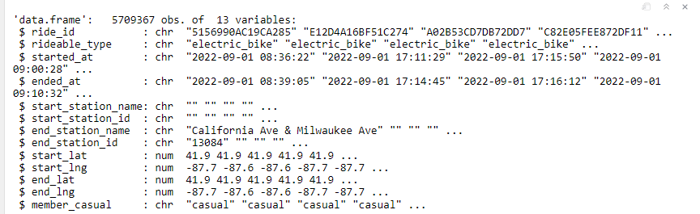
</p>
fig1.png
### Inspecting data frame
Quick view using head() and summary()

```{r}
head(all_trips)
```
<p align="center">
  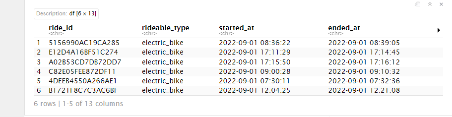
</p>
```{r}
summary(all_trips)
```
<p align="center">
  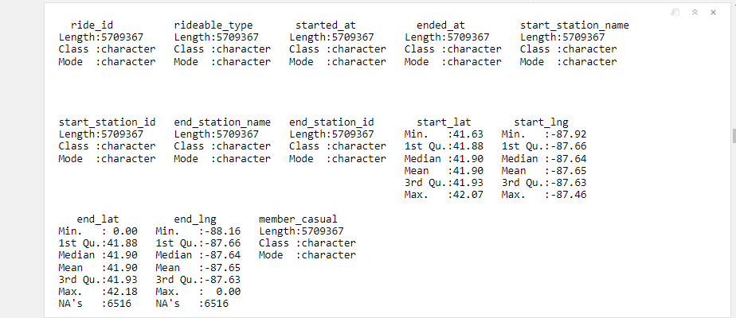
</p>
###Inspect column names

```{r}
colnames(all_trips)  #List of column names
```
<p align="center">
  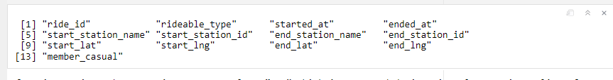
</p>

After inspection, there are is an extra column “… 1” which is not needed since it only contains a list of numbers which correspond to the row number - this was created when the the 12-months worth of data was created. This will need to be removed in the cleaning process.

Check the total number of rows is **5709367** after combining the 12-month data.
## Cleaning & Formatting the Data
### Confirm Correct Categories
Prior to 2022, Cyclistic used different names for casual and member riders. This data is from 2023, but we still want to confirm that the categorical terms for casual riders (“casual”) and annual members (“members”) are still being used.

##Adding New Columns
This will allow us to aggregate ride data for each month, day, or time … before completing these operations we could only aggregate at the ride level
```{r}
all_trips$date <- as.Date(all_trips$started_at) #The default format is yyyy-mm-dd
all_trips$month <- format(as.Date(all_trips$date), "%m")
all_trips$day <- format(as.Date(all_trips$date), "%d")
all_trips$year <- format(as.Date(all_trips$date), "%Y")
all_trips$day_of_week <- format(as.Date(all_trips$date), "%A")
all_trips$time <- format(all_trips$started_at, format = "%H:%M")
all_trips$ride_length <- difftime(all_trips$ended_at,all_trips$started_at)
```


##Time is converted to POSIXct with the Chicago timezone

```{r}
all_trips$time <- as.POSIXct(all_trips$time, format = "%H:%M", tz = "America/Chicago")
is.POSIXct(all_trips$time)
```
```{r}
#Remove na
 #all_trips <- select(all_trips, -time)  
```


###Check the Dataframe 
```{r}
print.data.frame(head(all_trips))
```

##Create column for trip duration
```{r}
all_trips$ride_length <- difftime(all_trips$ended_at,all_trips$started_at)/60
```
##Trip duration is converted to numeric
```{r}
all_trips$ride_length <- as.numeric(as.character(all_trips$ride_length))
is.numeric(all_trips$ride_length)
```
##Removing “bad” date

```{r}
all_trips_v2 <- all_trips[!(all_trips$start_station_name == "HQ QR" | all_trips$ride_length<0),]
```

## 4&5. Analyze and Share the Data
Now that we have a reliable data frame, let's start by comparing how many trips each group has taken. We can use descriptive analysis to learn more about how members of Cyclistic rideshare differ from casual riders.

Let’s start by comparing how many trips each group has taken.

```{r}
all_trips_v2 %>%  
  drop_na(member_casual) %>%
  group_by(member_casual) %>%
  count() %>%
  ungroup() %>%
  mutate(perc = `n` / sum(`n`)) %>%
  arrange(perc) %>%
  mutate(labels = scales::percent(perc)) %>%
  ggplot(aes(x="", 
             y=perc, 
             fill=member_casual))  +
  geom_bar(stat="identity", width=1, color = "white") +
  geom_text(aes(label = labels), color = "white",
            position = position_stack(vjust = 0.5)) +
  coord_polar("y", start=0) +
  theme_void()
```
<p align="center">
  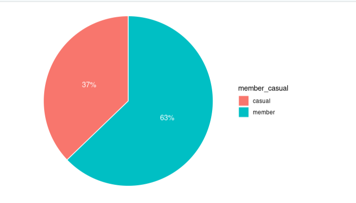
</p>
Looking at this pie chart, it shows that members take significantly more trips than casual riders.

###Comparison between members and casual riders
#### Mean
```{r}
aggregate(all_trips_v2$ride_length ~ all_trips_v2$member_casual, FUN = mean)
```
<p align="center">
  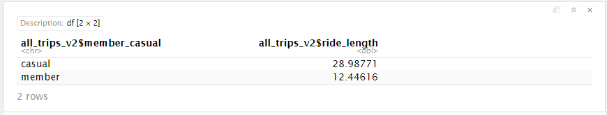
</p>

### Median 
```{r}
aggregate(all_trips_v2$ride_length ~ all_trips_v2$member_casual, FUN = median)
```
<p align="center">
  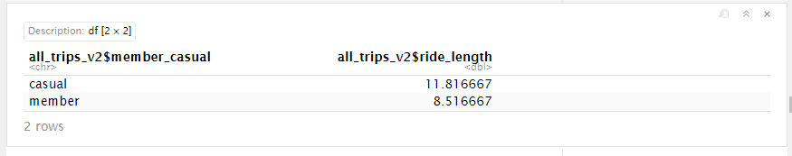
</p>

### Max
```{r}
aggregate(all_trips_v2$ride_length ~ all_trips_v2$member_casual, FUN = max)
```
<p align="center">
  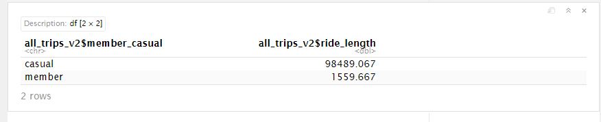
</p>

### Min
```{r}
aggregate(all_trips_v2$ride_length ~ all_trips_v2$member_casual, FUN = min)
```
<p align="center">
  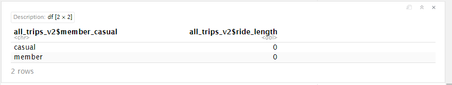
</p>
In contrast to casual riders, member riders’ make shorter trips. This indicates that, while members do ride the bikes more frequently, casual riders tend to spend more time out on the road.

```{r}
all_trips_v2$day_of_week <- ordered(all_trips_v2$day_of_week, levels=c("Sunday", "Monday", "Tuesday", "Wednesday", "Thursday", "Friday", "Saturday"))
```
## Customer Type vs. Day of the week
### Average
```{r}
all_trips_v2 %>%  
  drop_na(member_casual) %>%
  group_by(member_casual, day_of_week) %>% 
  summarise(average_trip_duration = mean(ride_length), .groups = 'keep') %>%
  ggplot(aes(x = day_of_week, y = average_trip_duration, fill = member_casual)) +
  geom_col(width=0.5, position = position_dodge(width=0.5)) + 
  labs(title ="Average trip duration by customer type Vs. Day of the week")
```
<p align="center">
  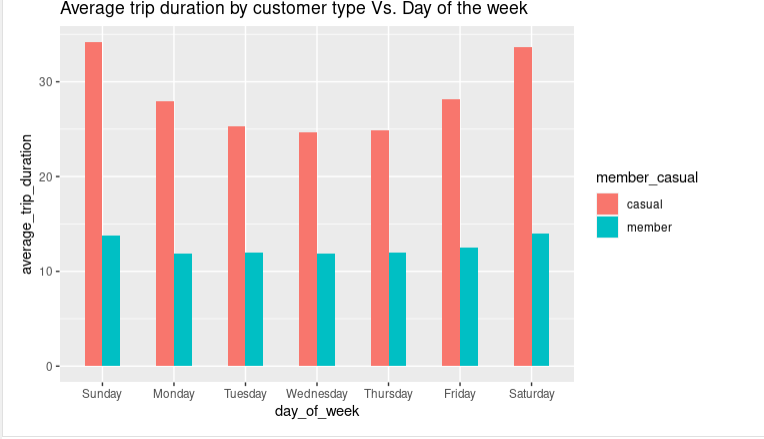
</p>
A member’s typical ride lasts less than half as long as that of a casual rider. It’s also interesting to see that while weekend rides tend to be longer for casual riders, regular riders tend to keep their average ride length fairly constant every day of the week. Please take note that this does not imply that casual riders necessarily cover greater distances.

### Count
```{r}
all_trips_v2 %>%  
  drop_na(member_casual) %>%
  group_by(member_casual, month) %>% 
  summarise(number_of_rides = n(), .groups = 'keep') %>% 
  arrange(member_casual, month)  %>% 
  ggplot(aes(x = month, y = number_of_rides, fill = member_casual)) +
  labs(title ="Total trips by customer type Vs. Month") +
  theme(axis.text.x = element_text(angle = 30)) +
  geom_col(width=0.5, position = position_dodge(width=0.5)) +
  scale_y_continuous(labels = function(x) format(x, scientific = FALSE))
```
<p align="center">
  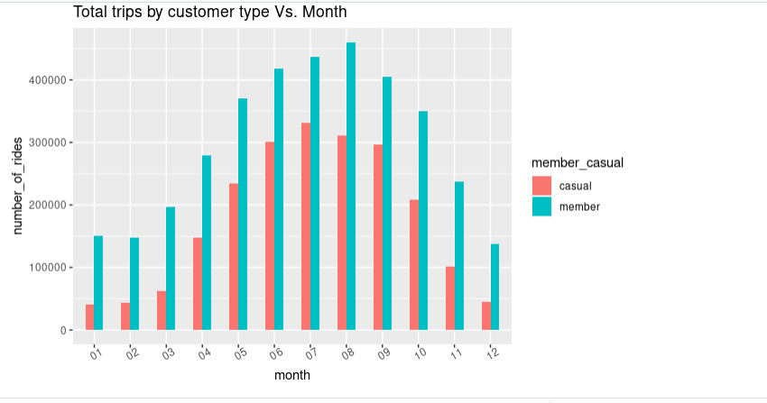
</p>
Based on the data presented above, it appears that Saturdays and Sundays see the highest volume of casual riders, while weekdays are busier for members. This implies that the bikes may be primarily used for non-leisure purposes by the annual members.

##Customer Type vs. Month
### Average
```{r}
all_trips_v2 %>%  
  drop_na(member_casual) %>%
  group_by(member_casual, month) %>% 
  summarise(average_trip_duration = mean(ride_length), .groups = 'keep') %>%
  ggplot(aes(x = month, y = average_trip_duration, fill = member_casual)) +
  geom_col(width=0.5, position = position_dodge(width=0.5)) + 
  labs(title ="Average trip duration by customer type Vs. Month")
```
<p align="center">
  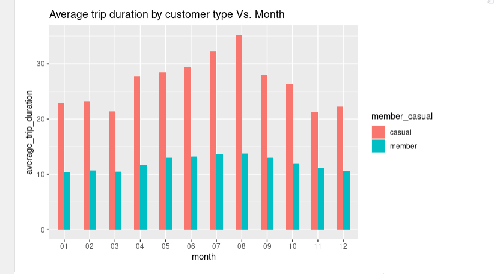
</p>
Over the course of a year, the typical ride time for a club member is between 10-15 minutes. There is a clear pattern when looking at casual riders, whose average trip duration varies from about 25 minutes at the end of the year to more than 35 minutes at the beginning of the year.
### Count 

```{r}
all_trips_v2 %>%  
  drop_na(member_casual) %>%
  group_by(member_casual, month) %>% 
  summarise(number_of_rides = n(), .groups = 'keep') %>% 
  arrange(member_casual, month)  %>% 
  ggplot(aes(x = month, y = number_of_rides, fill = member_casual)) +
  labs(title ="Total trips by customer type Vs. Month") +
  theme(axis.text.x = element_text(angle = 30)) +
  geom_col(width=0.5, position = position_dodge(width=0.5)) +
  scale_y_continuous(labels = function(x) format(x, scientific = FALSE))
```
<p align="center">
  
</p>
According to the graph, the busiest months of the year for members and casual riders are June, July, and August. This could be attributed to an external factor, like cold weather, that might have hindered with customer needs. Members, however, take significantly more rides than casual riders do during the rest of the year, including the winter months.

##Rideable type

```{r}
ride_type <- all_trips_v2 %>% ggplot(aes(x = member_casual, fill = rideable_type)) + 
  geom_bar() +
  theme_minimal() + 
  theme(axis.text.x  = element_text(angle = 45)) +
  labs(title = "Types of Bicycles Used",
       subtitle = "Period: 2022/09 - 2023/08",
       x = "Type of Rider",
       y = "Count")
ride_type + scale_fill_brewer(palette = "Set1", name = " ",
                              labels = c("Classic bike",
                                         "Docked bike",
                                         "Electric bike")) +
  scale_x_discrete(labels = c("Casual", "Member"))
```
<p align="center">
  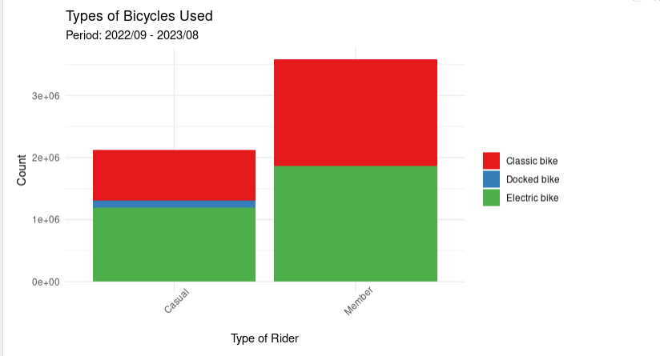
</p>
###Observations:

1. Only casual riders use docked bikes

2. Both casual and annual riders use classic bikes more than electric bikes, 

3. although the difference is subtle within casual riders


## Customer Type vs. Time

```{r}
all_trips_v2 %>%
  drop_na(member_casual) %>%
  group_by(member_casual, time) %>% 
  summarise(number_of_trips = n(), .groups = 'keep') %>%
  ggplot(aes(x = time, y = number_of_trips, color = member_casual, group = member_casual)) +
  geom_line() +
  scale_x_datetime(date_breaks = "1 hour", minor_breaks = NULL,
                   date_labels = "%H:%M", expand = c(0,0)) +
  theme(axis.text.x = element_text(angle = 90)) +
  labs(title ="Demand over 24 hours of a day", x = "Time of the day")
```
<p align="center">
  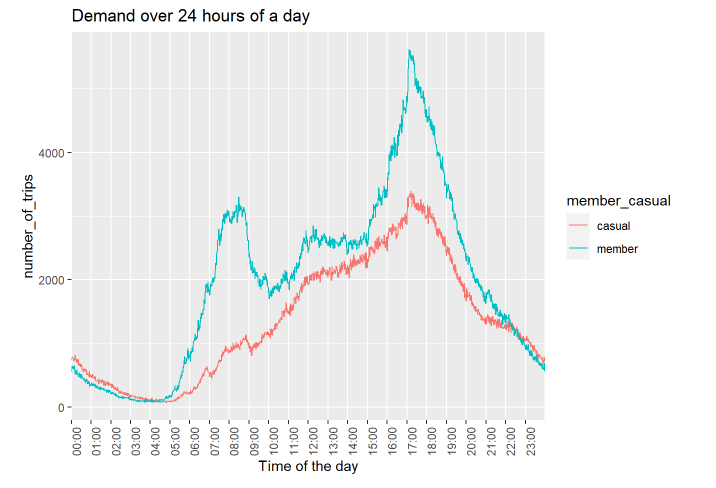
</p>

Members have two distinct peak demand periods: 7-9 AM and 5-6 PM, the last of which overlaps with the peak demand periods of casual riders. It’s possible to speculate that, given the high levels of interest shown before and after business hours, the majority of members are people on their way to or from work, but this assumption needs more data to support it.


## 6. Act

## Key Takeaways

1. Casual riders made 37% of total trips, while member riders make up 63% during September 2022 to August 2023.


2. Annual members take more trips, while casual riders take longer trips.

3. Casual customers use bikeshare services more during weekends, while members use them consistently over the entire week.

4. Both types, but especially casual riders, bike significantly less during the winter months.

5. Average trip duration of casual riders is more than twice that of member riders over any given day of the week cumulatively.

6. Casual riders ride longer during the first half of the year compared to the second half, while members clock relatively similar average trip duration month over month.

7. Casual riders prefer docked bikes the most, while classic bikes are popular among members.


Here's an organized list of the recommendations and additional data:

### Recommendations
#### Recommendation 1
a. Offer seasonal passes for riders who don’t want to bike during the winter.


b. Introduce a member-only rewards program based on trip duration to incentivize casual riders to sign up as members and be eligible for the rewards.

c. Offer discounted pricing during non-busy hours so that casual riders might choose to use bikes more often and level out demand over the day.

#### Recommendation 2 : Campaign for Saving the Earth

Cyclistic can boost its appeal by promoting a campaign focused on environmental protection and healthy living. By using social media and bike-share stations, the company can raise awareness of the benefits of bicycles, reduce gas emissions and encourage sustainable living. Initiatives such as litter-picking events and tree-planting linked to Cyclistic bikes can be set up, encouraging participants to contribute via questionnaires to win eco-friendly prizes, potentially increasing subscriptions.


### Additional Data for Analysis

a. Occupation of member riders: utilize this data to target non-members with similar occupations for membership promotion.

b. Age and gender profile: study the age and gender profiles to identify specific demographics that can be targeted for attracting new members.

c. Students: target students with tailored promotions or services, considering their specific needs and preferences.

d. Pricing details for members and casual riders: analyze pricing details to optimize the cost structure for casual riders or provide targeted discounts without compromising profit margins.

e . Address/neighborhood details of members: investigate if there are any location-specific parameters that encourage membership and use this information for targeted marketing or service improvements.
<p align="center">
  
</p>
--------------------------------------------END-------------------------------------------------------------

